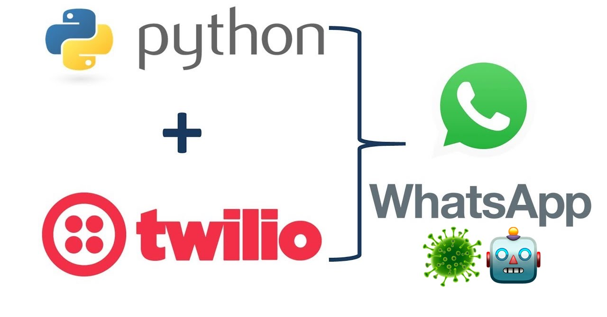
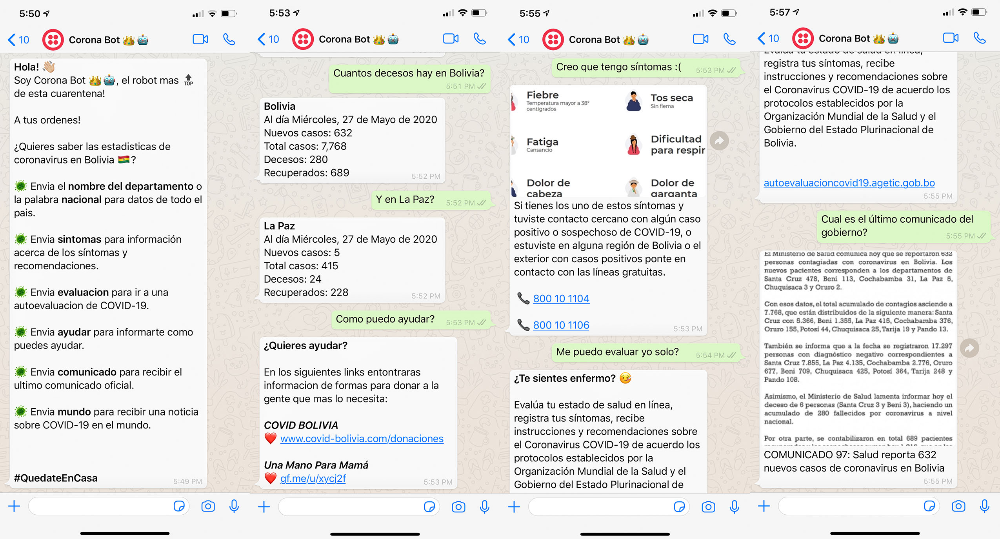
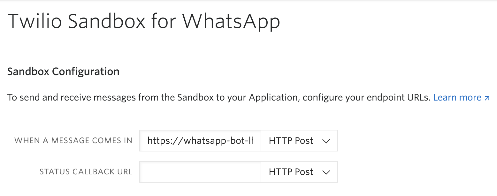

<!-- PROJECT SHIELDS -->
<!--
*** I'm using markdown "reference style" links for readability.
*** Reference links are enclosed in brackets [ ] instead of parentheses ( ).
*** See the bottom of this document for the declaration of the reference variables
*** for contributors-url, forks-url, etc. This is an optional, concise syntax you may use.
*** https://www.markdownguide.org/basic-syntax/#reference-style-links
-->
[![Contributors][contributors-shield]][contributors-url]
[![Forks][forks-shield]][forks-url]
[![Python Badge]][Python Badge]
[![MIT License][license-shield]][license-url]
[![LinkedIn][linkedin-shield]][linkedin-url]


<!-- PROJECT LOGO -->
<br />
<p align="center">
  <a href="images/logo.jpg">
    
  </a>

  <h3 align="center">CORONAVIRUS BOLIVIA 🇧🇴 WHATSAPP BOT</h3>

  <p align="center">
    Whatsapp bot that gives information about statistics, procedures and news regarding the COVID-19 pandemic in Bolivia. 
    <br />
    <a href="https://https://github.com/lhandal/corona-bot"><strong>Explore the docs »</strong></a>
    <br />
    <br />
    <a href="https://https://github.com/lhandal/corona-bot">View Demo</a>
    ·
    <a href="https://https://github.com/lhandal/corona-bot/issues">Report Bug</a>
    ·
    <a href="https://https://github.com/lhandal/corona-bot/issues">Request Feature</a>
  </p>
</p>


<!-- TABLE OF CONTENTS -->
## Table of Contents

* [About the Project](#about-the-project)
  * [Built With](#built-with)
* [Getting Started](#getting-started)
  * [Prerequisites](#prerequisites)
  * [Installation](#installation)
* [Usage](#usage)
* [Roadmap](#roadmap)
* [Contributing](#contributing)
* [License](#license)
* [Contact](#contact)
* [Acknowledgements](#acknowledgements)


<!-- ABOUT THE PROJECT -->
## About The Project

I appologize in advance because some of the code and the screenshots provided are in spanish, since the project is intended for a Bolivian public and spanish is the main spoken language. I do plan to bring this bot to a larger global audience in the future.

<!-- PROJECT LOGO -->
<br />
<p align="center">
  <a href="images/probs.jpg">
    
  </a>
  </p>
</p>
  
This project started with the motivation of learning how to build a chatbot with Flask and Python. After succesfully creating a bot that could:

* Reply to basic commands
* Send images and links
* Send static hardcoded information 

I decided to add a scraper script that could get updated data every time from the official Bolivian government website, as well as making calls to external APIs.
All the code is hosted in Heroku for ease of use and resilience.

This bot is intended to help inform the population of my country about safety measures, official statements and current statistics. As well as providing contact resources in case of an emergency.


### Built With

* [Python](https://www.python.org/)
* [Flask](https://palletsprojects.com/p/flask/)
* [Twilio](https://www.twilio.com/)
* [Heroku](https://www.heroku.com/)
* [Beautiful Soup](https://www.crummy.com/software/BeautifulSoup/bs4/doc/)


<!-- GETTING STARTED -->
## Getting Started

To get a local copy up and running follow these simple steps.

### Prerequisites

- Environment running python 3.6
- Twilio account with WhatsApp sandbox
- Heroku account

### Installation
 
1. Clone the repo
```shell script
$ git clone https://github.com/lhandal/corona-bot.git
```
2. Install required packages
```shell script
$ pip install -r requirements.txt
```

3. Create a blank app in [Heroku](https://dashboard.heroku.com/new-app)

4. Deploy the app in Heroku
```shell script
$ heruko login #login
```
```shell script
$ git init
$ heroku git:remote -a {heroku-project-name}
```
```shell script
$ git add .
$ git commit -m "Final Commit Deploying to Heroku"
$ git push heroku master
```

In my case I used GitHub CI/CD offered by heroku to redeploy the app with every commit to my repo.
You can configure this inside the app preferences!

5. Copy your Heroku app URL into [Twilio's sandbox](https://www.twilio.com/console/sms/whatsapp/sandbox)
<!-- PROJECT LOGO -->
<br />
<p align="left">
  <a href="images/sandbox.png">
    
  </a>
  </p>
</p>


<!-- USAGE EXAMPLES -->
## Usage

**WhatsApp Me URL**
To use this bot click on this [LINK](https://wa.me/14155238886?text=join%20religious-steady)

**Manual Way**

Simply send a WhatsApp message to **+1 (415) 523-8886** with code **join religious-steady**.
It will show a message saying connected to sandbox.
Now start talking by saying  **Hi | Hola | Hello | Menu** and it will display the followup chat options.

## Features

The implemented commands are:

- Statistics of COVID-19 cases in each Bolivian city as well as the whole country
- Possible symptoms and recommendations
- Perform a self-evaluation of symptoms to see if you have the virus.
- Donation options for fundraisers against Coronavirus in Bolivia.
- Latest official government statements.
- Latest worldwide COVID-19 news (in a very satiric way).


<!-- ROADMAP -->
## Roadmap

See the [open issues](https://github.com/lhandal/corona-bot/issues) for a list of proposed features (and known issues).

<!-- TODOS -->
## TODOs

* Implement a NLP model to be able to hold conversations better. 
* Implement other countries and worldwide statistics.
* Increase the number of input options for more robustness.
* Add an automatic daily stats sender to everyone who is subscribed.


<!-- CONTRIBUTING -->
## Contributing

Contributions are what make the open source community such an amazing place to be learn, inspire, and create. Any contributions you make are **greatly appreciated**.

1. Fork the Project
2. Create your Feature Branch (`git checkout -b feature/AmazingFeature`)
3. Commit your Changes (`git commit -m 'Add some AmazingFeature'`)
4. Push to the Branch (`git push origin feature/AmazingFeature`)
5. Open a Pull Request


<!-- LICENSE -->
## License

Distributed under the MIT License. See `LICENSE` for more information.


<!-- CONTACT -->
## Contact

Leandro Handal

- Email: [lhandalb@gmail.com](mailto:lhandalb@gmail.com)
- LinkedIn: [lhandal](https://linkedin.com/in/lhandal)
- Twitter: [@lhandalb](https://twitter.com/lhandalb)
- Instagram: [@lhandal](https://instagram.com/lhandal)

Project Link: [https://https://github.com/lhandal/corona-bot](https://https://github.com/lhandal/corona-bot)

<!-- MARKDOWN LINKS & IMAGES -->
<!-- https://www.markdownguide.org/basic-syntax/#reference-style-links -->
[contributors-shield]: https://img.shields.io/github/contributors/othneildrew/Best-README-Template.svg?style=flat-square
[contributors-url]: https://https://github.com/lhandal/corona-bot/graphs/contributors
[forks-shield]: https://img.shields.io/github/forks/othneildrew/Best-README-Template.svg?style=flat-square
[forks-url]: https://https://github.com/lhandal/corona-bot/network/members
[stars-shield]: https://img.shields.io/github/stars/othneildrew/Best-README-Template.svg?style=flat-square
[stars-url]: https://https://github.com/lhandal/corona-bot/stargazers
[license-shield]: https://img.shields.io/github/license/othneildrew/Best-README-Template.svg?style=flat-square
[license-url]: https://https://github.com/lhandal/corona-bot/blob/master/LICENSE.txt
[linkedin-shield]: https://img.shields.io/badge/-LinkedIn-black.svg?style=flat-square&logo=linkedin&colorB=555
[linkedin-url]: https://linkedin.com/in/lhandal
[product-screenshot]: images/screenshot.png
[Python Badge]:https://img.shields.io/badge/Made%20with-Python-blue
